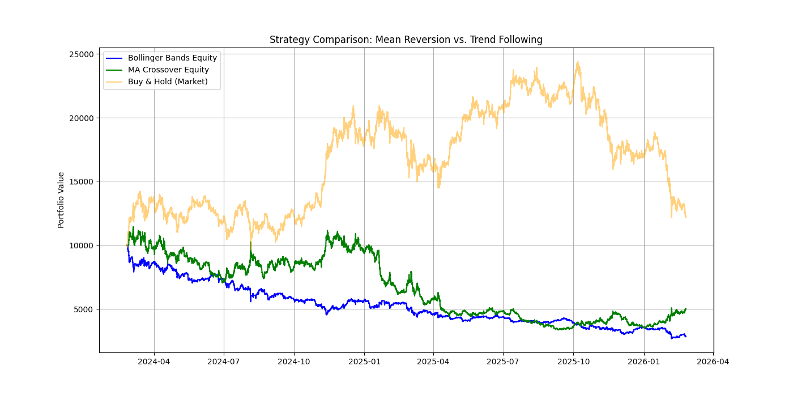

# Quantitative Backtesting Engine

A high-performance, fully vectorized backtesting module designed to simulate algorithmic trading strategies against historical market data. 

Built entirely with Python, Pandas, and NumPy, this engine bypasses traditional `for`-loop iteration, allowing it to efficiently process datasets of over 1 million rows in fractions of a second. It calculates core viability metrics and visualizes equity curves to provide immediate feedback on quantitative models.

## Key Features

* **Vectorized Data Processing:** Leverages Pandas and NumPy to handle large-scale historical data without computational bottlenecks.
* **Performance Metrics:** Automatically calculates Annualized Return, Sharpe Ratio, and Maximum Drawdown.
* **Transaction Cost Modeling:** Simulates realistic trading environments by accounting for configurable fee structures on execution points.
* **Strategy Agnostic:** Modular architecture allows for easy plugging of custom signals (e.g., Mean Reversion, Trend Following, or Machine Learning classifications).
* **Data Visualization:** Plots strategy equity against buy-and-hold benchmarks using Matplotlib.

## Repository Structure

\`\`\`text
quant-backtest-engine/
├── core/
│   ├── backtester.py       # Main vectorized engine
│   └── metrics.py          # Viability calculations (Sharpe, Drawdown)
├── strategies/
│   ├── mean_reversion.py   # Bollinger Bands implementation
│   └── ma_crossover.py     # Trend-following implementation
├── main.py                 # Execution script
└── requirements.txt        # Project dependencies
\`\`\`

## Installation & Usage

1. **Clone the repository:**
   \`\`\`bash
   git clone https://github.com/yourusername/quant-backtest-engine.git
   cd quant-backtest-engine
   \`\`\`

2. **Install dependencies:**
   \`\`\`bash
   pip install -r requirements.txt
   \`\`\`

3. **Run the simulation:**
   \`\`\`bash
   python main.py
   \`\`\`

## Example Output

Running the engine executes the strategies, prints the performance metrics to the console, and renders a comparative equity curve visualization.

\`\`\`text
==================================================
METRIC               | BOLLINGER    | MA CROSSOVER
==================================================
Annualized Return    | -2.58%       | -1.45%
Sharpe Ratio         | -0.34        | -0.15
Max Drawdown         | -73.18%      | -70.69%
==================================================
\`\`\`
*Analysis: On a 1-hour timeframe, high volatility and frequent whipsawing caused both standard mean-reversion and trend-following models to underperform the benchmark, heavily compounded by the drag of 0.1% transaction fees per trade.*

## Future Implementations
* Integration with a Real-Time Stock Market Dashboard (via Redis/Docker).
* Advanced position sizing algorithms based on rolling volatility.